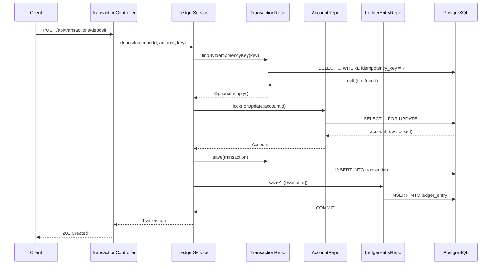
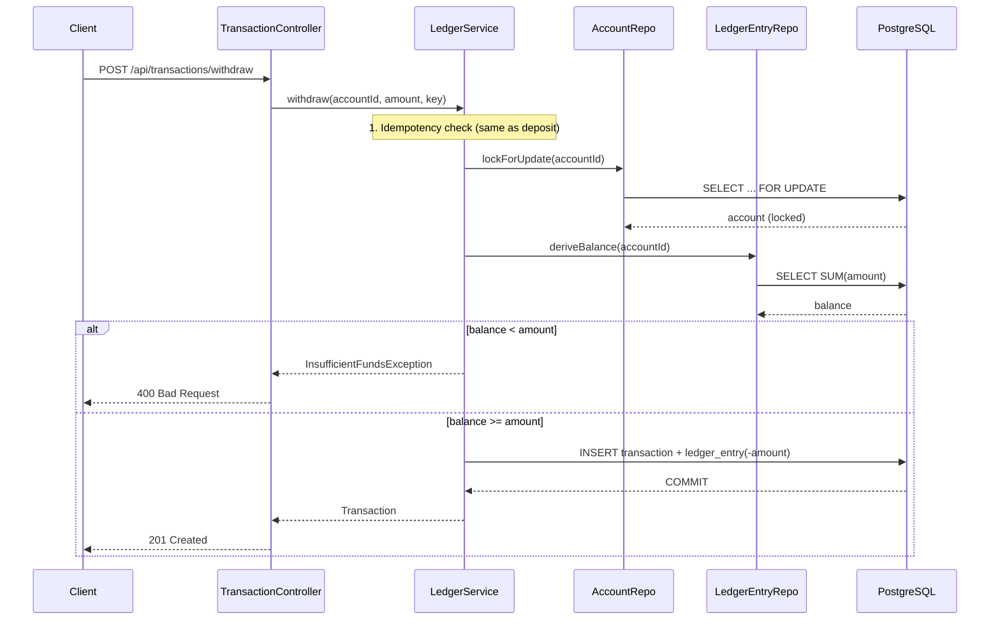
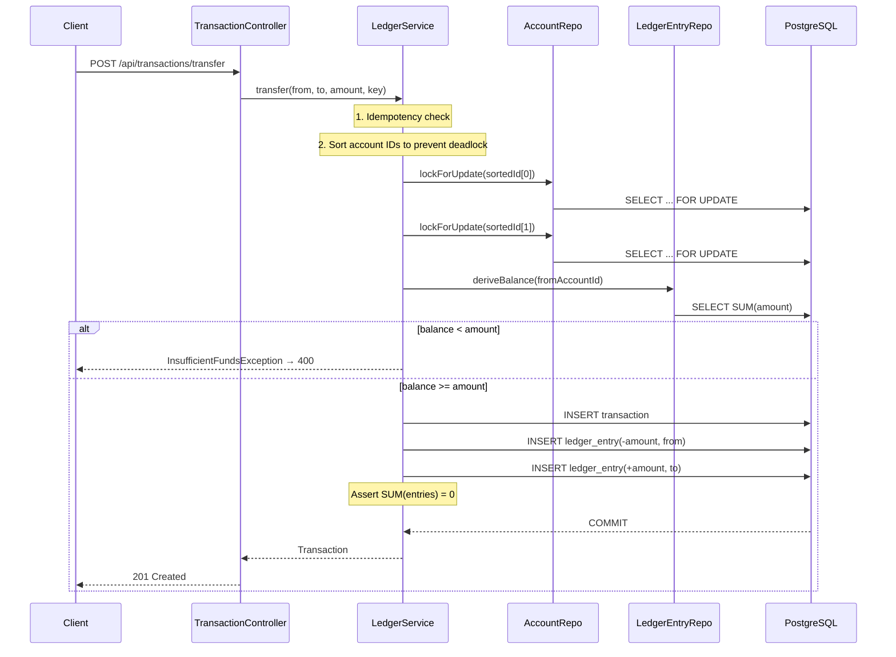
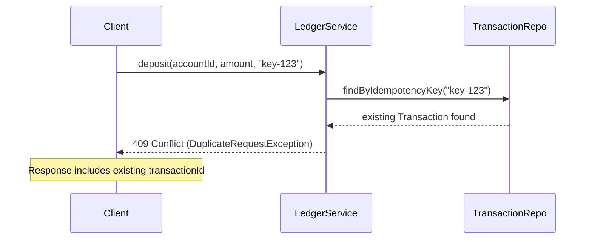
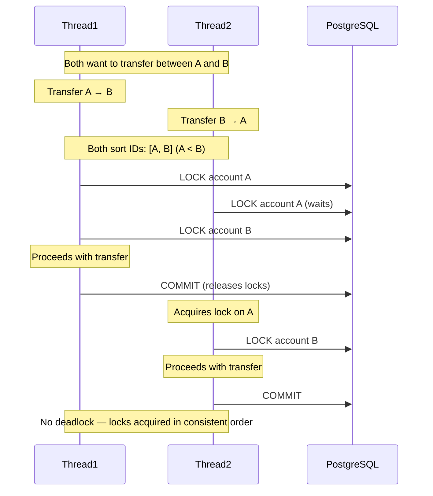

# Sequence Diagrams

## Deposit Flow

```mermaid
sequenceDiagram
    participant Client
    participant TransactionController
    participant LedgerService
    participant TransactionRepo
    participant AccountRepo
    participant LedgerEntryRepo
    participant PostgreSQL

    Client->>TransactionController: POST /api/transactions/deposit
    TransactionController->>LedgerService: deposit(accountId, amount, key)
    
    LedgerService->>TransactionRepo: findByIdempotencyKey(key)
    TransactionRepo->>PostgreSQL: SELECT ... WHERE idempotency_key = ?
    PostgreSQL-->>TransactionRepo: null (not found)
    TransactionRepo-->>LedgerService: Optional.empty()
    
    LedgerService->>AccountRepo: lockForUpdate(accountId)
    AccountRepo->>PostgreSQL: SELECT ... FOR UPDATE
    PostgreSQL-->>AccountRepo: account row (locked)
    AccountRepo-->>LedgerService: Account
    
    LedgerService->>TransactionRepo: save(transaction)
    TransactionRepo->>PostgreSQL: INSERT INTO transaction
    
    LedgerService->>LedgerEntryRepo: saveAll([+amount])
    LedgerEntryRepo->>PostgreSQL: INSERT INTO ledger_entry
    
    PostgreSQL-->>LedgerService: COMMIT
    LedgerService-->>TransactionController: Transaction
    TransactionController-->>Client: 201 Created
```

## Withdraw Flow

```mermaid
sequenceDiagram
    participant Client
    participant TransactionController
    participant LedgerService
    participant AccountRepo
    participant LedgerEntryRepo
    participant PostgreSQL

    Client->>TransactionController: POST /api/transactions/withdraw
    TransactionController->>LedgerService: withdraw(accountId, amount, key)
    
    Note over LedgerService: 1. Idempotency check (same as deposit)
    
    LedgerService->>AccountRepo: lockForUpdate(accountId)
    AccountRepo->>PostgreSQL: SELECT ... FOR UPDATE
    PostgreSQL-->>AccountRepo: account (locked)
    
    LedgerService->>LedgerEntryRepo: deriveBalance(accountId)
    LedgerEntryRepo->>PostgreSQL: SELECT SUM(amount)
    PostgreSQL-->>LedgerEntryRepo: balance
    
    alt balance < amount
        LedgerService-->>TransactionController: InsufficientFundsException
        TransactionController-->>Client: 400 Bad Request
    else balance >= amount
        LedgerService->>PostgreSQL: INSERT transaction + ledger_entry(-amount)
        PostgreSQL-->>LedgerService: COMMIT
        LedgerService-->>TransactionController: Transaction
        TransactionController-->>Client: 201 Created
    end
```

## Transfer Flow

```mermaid
sequenceDiagram
    participant Client
    participant TransactionController
    participant LedgerService
    participant AccountRepo
    participant LedgerEntryRepo
    participant PostgreSQL

    Client->>TransactionController: POST /api/transactions/transfer
    TransactionController->>LedgerService: transfer(from, to, amount, key)
    
    Note over LedgerService: 1. Idempotency check
    
    Note over LedgerService: 2. Sort account IDs to prevent deadlock
    
    LedgerService->>AccountRepo: lockForUpdate(sortedId[0])
    AccountRepo->>PostgreSQL: SELECT ... FOR UPDATE
    LedgerService->>AccountRepo: lockForUpdate(sortedId[1])
    AccountRepo->>PostgreSQL: SELECT ... FOR UPDATE
    
    LedgerService->>LedgerEntryRepo: deriveBalance(fromAccountId)
    LedgerEntryRepo->>PostgreSQL: SELECT SUM(amount)
    
    alt balance < amount
        LedgerService-->>Client: InsufficientFundsException → 400
    else balance >= amount
        LedgerService->>PostgreSQL: INSERT transaction
        LedgerService->>PostgreSQL: INSERT ledger_entry(-amount, from)
        LedgerService->>PostgreSQL: INSERT ledger_entry(+amount, to)
        
        Note over LedgerService: Assert SUM(entries) = 0
        
        PostgreSQL-->>LedgerService: COMMIT
        LedgerService-->>TransactionController: Transaction
        TransactionController-->>Client: 201 Created
    end
```

## Duplicate Request Flow

```mermaid
sequenceDiagram
    participant Client
    participant LedgerService
    participant TransactionRepo

    Client->>LedgerService: deposit(accountId, amount, "key-123")
    LedgerService->>TransactionRepo: findByIdempotencyKey("key-123")
    TransactionRepo-->>LedgerService: existing Transaction found
    LedgerService-->>Client: 409 Conflict (DuplicateRequestException)
    Note over Client: Response includes existing transactionId
```

## Deadlock Prevention (Sorted Locking)

```mermaid
sequenceDiagram
    participant Thread1
    participant Thread2
    participant PostgreSQL

    Note over Thread1,Thread2: Both want to transfer between A and B

    Note over Thread1: Transfer A → B
    Note over Thread2: Transfer B → A

    Note over Thread1,Thread2: Both sort IDs: [A, B] (A < B)

    Thread1->>PostgreSQL: LOCK account A
    Thread2->>PostgreSQL: LOCK account A (waits)
    Thread1->>PostgreSQL: LOCK account B
    Note over Thread1: Proceeds with transfer
    Thread1->>PostgreSQL: COMMIT (releases locks)
    Note over Thread2: Acquires lock on A
    Thread2->>PostgreSQL: LOCK account B
    Note over Thread2: Proceeds with transfer
    Thread2->>PostgreSQL: COMMIT
    
    Note over Thread1,Thread2: No deadlock — locks acquired in consistent order
```
